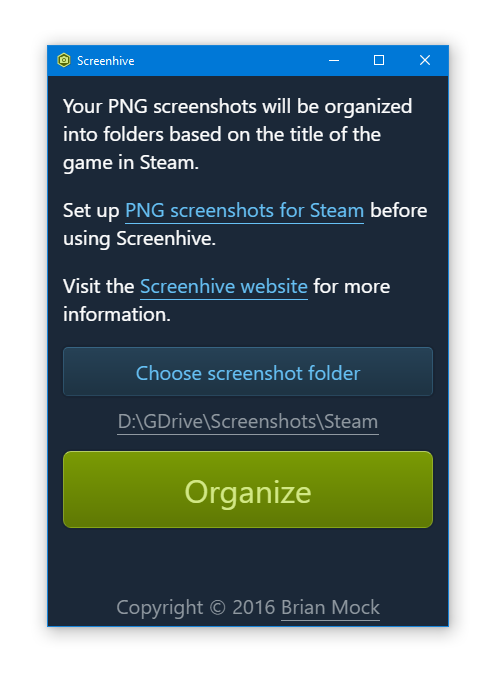

# Screenhive

Screenhive is an organizer for Steam PNG screenshot folders.

Please read [the wiki page on setting up Steam PNG screenshots][1] before using Screenhive.

[1]: https://github.com/wavebeem/screenhive/wiki
